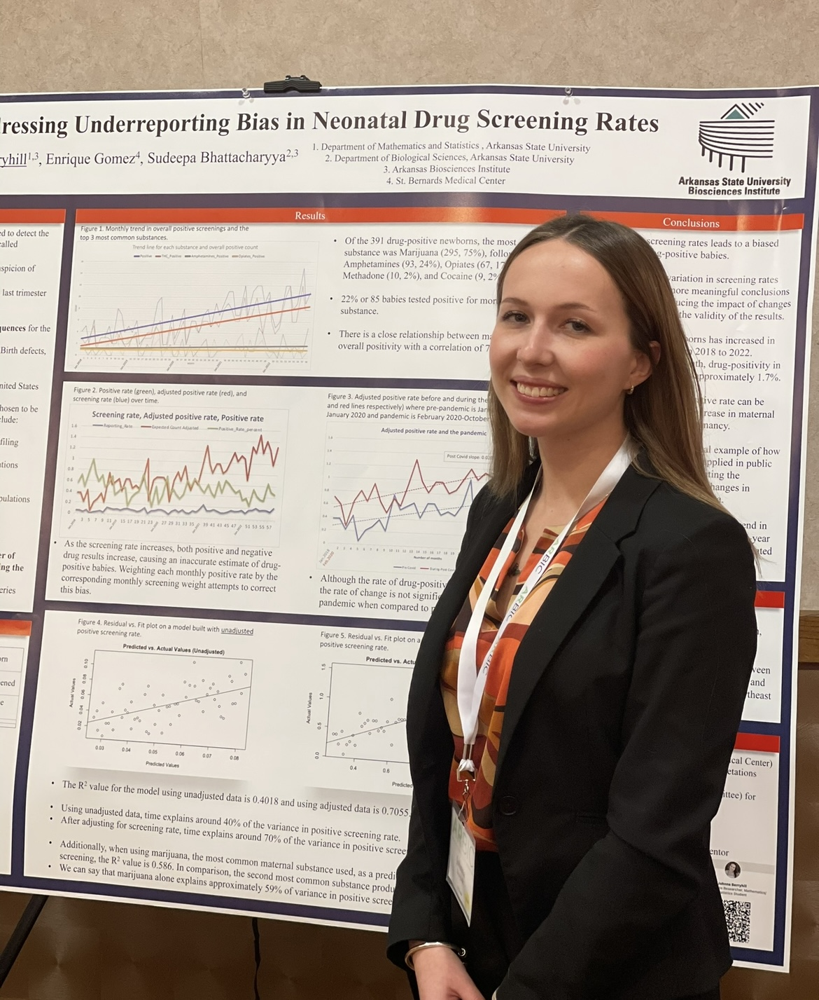

Although I used to be very nervous giving presentations, my mentor (Dr. Sudeepa Bhattacharyya) taught me the importance of being able to share research with others. I have attended many local and national conferences, which has increased my confidence and public speaking skills.   

  
  Each conference has a different audience, whether that be other statisticians and bioinformaticians, computer scientists, biologists, physicians, social workers, and more. Because of this, I have learned how to share my results in a way that anyone could understand. Data specialists often find themselves working in an interdisciplinary team, so this is an important skill to have.  

  

  

  
| N | Year | Type | Location | Title | Conference |
| --- | ---- | ---- | -------- | ----- | ---------- |
|1 | 2021 | Oral | Jonesboro, Ar | Identifying Major Depression Patient Subgroups Based on Neuropsychiatric Symptoms and Blood Markers | Create @ A-State Annual Symposium |
|2 | 2021 | Oral | Virtual | Identifying Major Depression Patient Subgroups Based on Neuropsychiatric Symptoms and Blood Markers | National Council on Undergraduate Research (NCUR) Annual Symposium |
|3 | 2022 | Oral | Virtual | Impact of Maternal Factors on Infant Mortality in Arkansas: Evidence from the Claims Database | National Council on Undergraduate Research (NCUR) Annual Symposium |
|4 | 2022 | Oral | Jonesboro, Ar | Impact of Maternal Factors on Infant Mortality in Arkansas: Evidence from the Claims Database | Create @ A-State Annual Symposium |
|5 | 2022 | Poster | Boston, Ma | Impact of Maternal Factors on Infant Mortality in Arkansas: Evidence from the Claims Database | American Public Health Association (APHA) Annual Meeting |
|6 | 2022 | Poster | Little Rock, Ar | Impact of Maternal Factors on Infant Mortality in Arkansas: Evidence from the Claims Database | Arkansas Summer Undergraduate Research Symposium (ASURS) |
|7 | 2023 | Oral | Jonesboro, Ar | Individual Level Social Determinants of Health and Multimorbidity Severity Prediction | Create @ A-State Annual Symposium |
|8 | 2023 | Oral | Little Rock, Ar | Harnessing Big Data: Revealing Hidden Disparities in Colorectal Cancer | OAK Supercomputing Conference |
|9 | 2023 | Oral | Atlanta, Ga | Harnessing Big Data: Revealing Hidden Disparities in Colorectal Cancer | American Public Health Association (APHA) Annual Meeting |
|10 | 2023 | Oral | Jonesboro, Ar | Individual Level Social Determinants of Health and Multimorbidity Severity Prediction | Undergraduate Thesis Defense |
|11 | 2023 | Oral | Jonesboro, Ar | Perinatal Substance Abuse in Northeast Arkansas | St. Bernard's Medical Center meeting |
|12 | 2023 | Poster | Little Rock, Ar | Addressing Underreporting Bias in Neonatal Drug Screening Rates | Arkansas Bioinformatics Consortium (ARBIC) Annual Meeting |
|13 | 2023 | Poster | Springdale, Ar | Individual Level Social Determinants of Health and Multimorbidity Severity Prediction | NSF EPSCoR DART Annual Conference |
|14 | 2023 | Poster | Little Rock, Ar | Harnessing Big Data: Revealing Hidden Disparities in Colorectal Cancer | OAK Supercomputing Conference |
|15 | 2024 | Poster | Little Rock, Ar | Spatial Modeling Highlights Risk Factors of Colorectal Cancer Screening Rates and Outcomes in Arkansas | Arkansas Bioinformatics Consortium (ARBIC) Annual Meeting |
|16 | 2024 | Poster | Jonesboro, Ar | Spatial Modeling Highlights Risk Factors of Colorectal Cancer Screening, Incidence, and Late-Stage Diagnosis in Arkansas | Create @ A-State Annual Symposium |

  

    
    
Conference 5

  

  

    
    
Conference 12

  

  

    
    
Undergrad Thesis Defense 10

  

  

    
    
Conference 15

  

  

    
    
Conference 16

  

