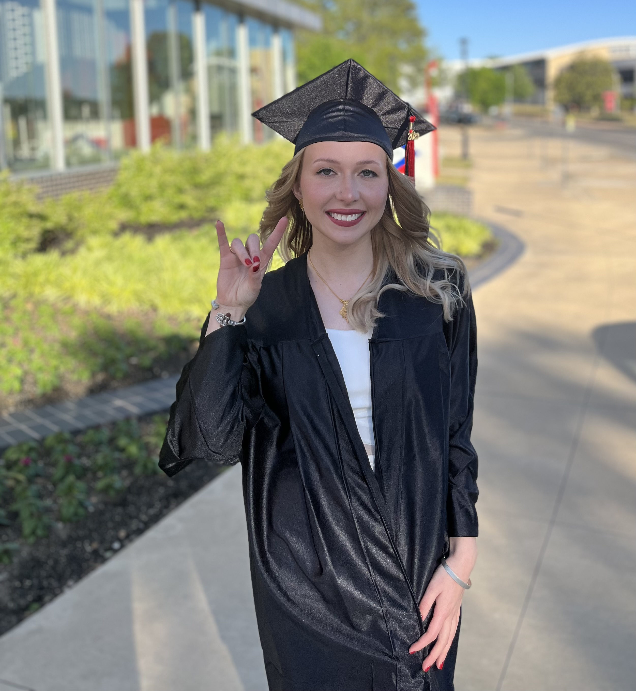
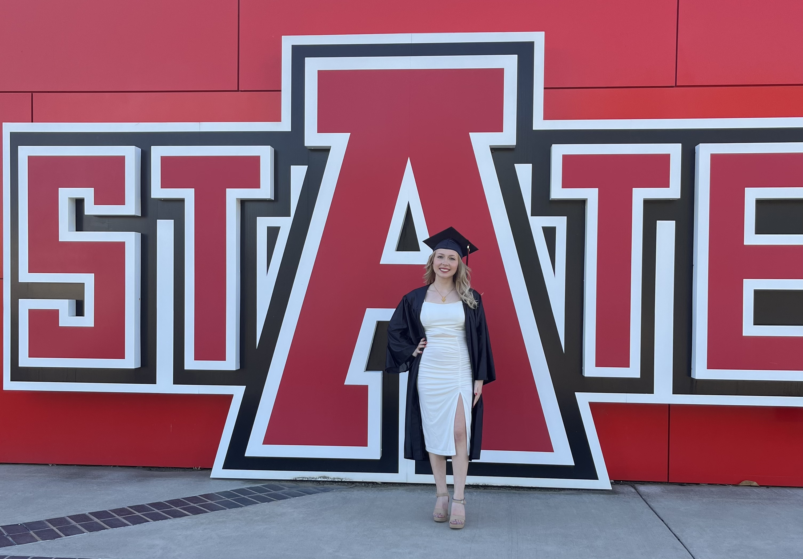

My educational background in mathematics and statistics has given me the skills to understand what is truly happening behind the scenes of popular statistical and machine learning techniques. Complex formulas, loss functions, and distributions don't scare me.  

   
Besides theory, my education has trained me in the basics of programming in R, Python, and SAS, and my projects as a research assistant have pushed me beyond the beginner status. 

#### M.S. in Statistics *2023-current*
Arkansas State University  
Expected graduation: May 2025  
Thesis in progress (see projects tab)   
Primary advisor: Dr. Sudeepa Bhattacharyya  
Relevant coursework:
  - Advanced biostatistics
  - Advanced probability theory
  - SAS programming
  - Machine learning
  - Multivariate statistics
  - Survival analysis

#### B.S. in Mathematics *2019-2023*
Arkansas State University  
Minor in Statistics  
Honors graduate  
Honors thesis defended (see projects tab)   
Primary advisor: Dr. Sudeepa Bhattacharyya  
Relevant coursework:
- Statistical analysis
- Probability theory
- Linear regression and ANOVA
- R programming
- Python programming

  

    
    
Wolves Up!🐺⬆️

  

  

    
    
Graduation picture 2023

  

